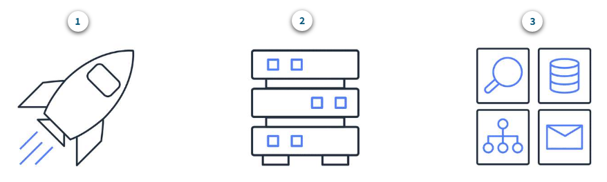
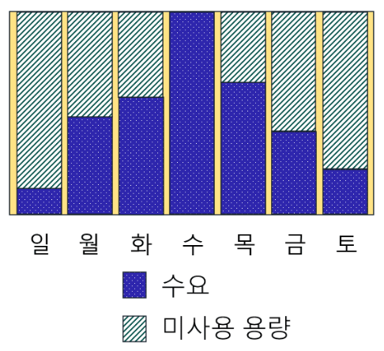

# 모듈 2 : 클라우드 컴퓨팅


## 📌 목차

### **00. [😎 모듈 2 소개](#😎-모듈-2-소개)**

### **01. [⚙ Amazon EC2 인스턴스 유형](#⚙-Amazon-EC2-인스턴스-유형)**

### **02. [💰 Amazon EC2 요금](#💰-Amazon-EC2-요금)**

### **03. [💠 Amazon EC2 확장](#💠-Amazon-EC2-확장)**

### **04. [🔱 Elastic Load Balancing을 사용하여 트래픽 리디렉션](#🔱-Elastic-Load-Balancing을-사용하여-트래픽-리디렉션)**

### **05. [👨‍👩‍👧‍👧 메시징 및 대기열](#👨‍👩‍👧‍👧-메시징-및-대기열)**

### **06. [🖥 추가 컴퓨팅 서비스](#🖥-추가-컴퓨팅-서비스)**

### **07. [💯 모듈 1 퀴즈](#💯-모듈-1-퀴즈)**


## 😎 모듈 2 소개

### **Ⅰ. 학습목표**

- 기본적인 Amazon EC2의 이점을 설명할 수 있습니다.
- 서로 다른 Amazon EC2 인스턴스 유형을 파악할 수 있습니다.
- Amazon EC2의 다양한 결제 옵션을 구분할 수 있습니다.
- Amazon EC2 Auto Scaling의 이점을 요약할 수 있습니다.
- Elastic Load Balancing의 이점을 요약할 수 있습니다.
- Elastic Load Balancing 사용 사례를 제시할 수 있습니다.
- Amazon Simple Notification Service(Amazon SNS)와 Amazon Simple Queue Service(Amazon SQS)의 차이점을 요약할 수 있습니다.
- 그 외 AWS 컴퓨팅 옵션을 요약할 수 있습니다.

### Ⅱ. Amazon Elastic Compute Cloud(Amazon EC2)

Amazon Elastic Compute Cloud(Amazon EC2)는 안전하고 크기 조정이 가능한 컴퓨팅 용량을 Amazon EC2 인스턴스로 클라우드에서 제공합니다. 예를 들어 회사의 리소스 아키텍처를 책임지고 새로운 웹 사이트를 지원해야 한다고 가정해 보겠습니다.

1. **온프레미스 리소스**를 사용할 경우
   - 미리 하드웨어를 구매해야 합니다.
   - 서버가 배달될 때까지 기다려야 합니다.
   - 물리적 데이터 센터에 서버를 설치해야 합니다.
   - 필요한 모든 구성을 수행해야 합니다.
2. **Amazon EC2 인스턴스**를 사용할 경우
   - AWS 클라우드에서 가상 서버를 사용하여 어플리케이션을 실행할 수 있습니다.
   - 몇 분이면 Amazon EC2 인스턴스를 프로비저닝하고 시작할 수 있습니다.
   - 워크로드 실행을 완료했다면 인스턴스 사용을 중지할 수 있습니다.
   - 인스턴스가 실행 중일 때 사용한 컴퓨팅 시간에 대해서만 비용을 지불하고 인스턴스가 중지 또는 종료된 상태에서는 비용을 지불하지 않습니다.
   - 필요한 서버 용량에 대해서만 비용을 지불하므로 비용을 절감할 수 있습니다.

### Ⅲ. Amazon EC2 작동 방식



1. **시작**

   먼저 인스턴스를 **시작**합니다. 

   기본 구성 인스턴스가 포함되어 있는 템플릿을 선택하여 시작합니다. 이러한 구성에는 운영 체제, 어플리케이션 서버 또는 어플리케이션이 포함됩니다. 또한 인스턴스의 특정 하드웨어 구성인 인스턴스 유형을 선택합니다.

   인스턴스 시작을 준비할 때 인스턴스로 들어오고 나가는 네트워크 트래픽을 제어할 보안 설정을 지정합니다. Amazon EC2 보안 기능은 이 과정의 뒷부분에서 더 자세히 알아보겠습니다.

2. **연결**

   다음으로 인스턴스에 **연결**합니다. 

   인스턴스는 여러 가지 방법으로 연결할 수 있습니다. 프로그램과 어플리케이션에는 인스턴스에 직접 연결하고 데이터를 교환하는 여러 가지 방법이 있습니다. 

   사용자가 로그인하여 인스턴스에 연결하고 컴퓨터 데스크탑에 액세스할 수도 있습니다.

3. **사용**

   인스턴스에 연결했다면 바로 **사용**할 수 있습니다. 

   명령을 실행하여 소프트웨어 설치, 스토리지 추가, 파일 복사 및 정리 등의 작업을 수행할 수 있습니다.


## ⚙ Amazon EC2 인스턴스 유형

### Ⅰ. Amazon EC2 인스턴스 유형

1. **범용 인스턴스 - 컴퓨팅, 메모리, 네트워킹 리소스를 균형있게 제공**

   **범용 인스턴스**는 컴퓨팅, 메모리, 네트워킹 리소스를 균형 있게 제공합니다. 다음과 같은 다양한 워크로드에 사용할 수 있습니다.

   - 어플리케이션 서버
   - 게임 서버
   - 엔터프라이즈 어플리케이션용 백엔드 서버
   - 중소 규모 데이터베이스

   컴퓨팅, 메모리, 네트워킹에 필요한 리소스가 거의 동일한 어플리케이션이 있다고 가정해 보겠습니다. 어플리케이션에 어느 한 리소스 영역에 대한 최적화가 필요하지 않기 때문에 범용 인스턴스에서 어플리케이션을 실행하는 것이 좋습니다.

2. **컴퓨팅 최적화 인스턴스 - 고성능 프로세서 제공**

   **컴퓨팅 최적화 인스턴스**는 고성능 프로세서를 활용하는 컴퓨팅 집약적인 어플리케이션에 적합합니다. 범용 인스턴스와 마찬가지로 컴퓨팅 최적화 인스턴스는 웹 서버, 어플리케이션 서버, 게임 서버와 같은 워크로드에 사용할 수 있습니다.

   하지만 컴퓨팅 최적화 어플리케이션은 고성능 웹 서버, 컴퓨팅 집약적 어플리케이션 서버 및 게임 전용 서버에 적합하다는 점이 다릅니다. 또한 컴퓨팅 최적화 인스턴스를 단일 그룹에서 많은 트랜잭션을 처리해야 하는 일괄 처리 워크로드에 사용할 수도 있습니다.

3. **메모리 최적화 인스턴스 - 고성능 데이터베이스에 적합**

   **메모리 최적화 인스턴스**는 메모리에서 대규모 데이터 세트를 처리하는 워크로드를 위한 빠른 성능을 제공하기 위해 설계되었습니다. 컴퓨팅에서 메모리는 임시 스토리지 영역입니다. 여기에는 중앙 처리 장치(CPU)가 작업을 완료하는 데 필요한 모든 데이터와 명령이 들어 있습니다. 컴퓨터 프로그램이나 어플리케이션은 스토리지에서 메모리로 로드된 후 실행됩니다. 이 사전 로드 프로세스 덕분에 CPU가 컴퓨터 프로그램에 직접 액세스할 수 있습니다.

   어플리케이션을 실행하기 전에 많은 데이터를 미리 로드해야 하는 워크로드가 있다고 가정해 보겠습니다. 고성능 데이터베이스일 수도 있고 방대한 양의 비정형 데이터의 실시간 처리가 필요한 워크로드일 수도 있습니다. 이러한 유형의 사용 사례에서는 메모리 최적화 인스턴스 사용을 고려합니다. 메모리 최적화 인스턴스를 사용하면 많은 메모리가 필요한 워크로드를 실행하고 뛰어난 성능을 얻을 수 있습니다.

4. **엑셀러레이티드 컴퓨팅 인스턴스**

   **엑셀러레이티드 컴퓨팅 인스턴스**는 하드웨어 엑셀러레이터 또는 코프로세서를 사용하여 일부 기능을 CPU에서 실행되는 소프트웨어에서보다 더 효율적으로 수행합니다. 이러한 기능의 예로는 부동 소수점 수 계산, 그래픽 처리, 데이터 패턴 일치 등이 있습니다.

   컴퓨팅에서 하드웨어 엑셀러레이터는 데이터 처리를 가속화할 수 있는 구성 요소입니다. 엑셀러레이티드 컴퓨팅 인스턴스는 그래픽 어플리케이션, 게임 스트리밍, 어플리케이션 스트리밍과 같은 워크로드에 적합합니다.

5. **스토리지 최적화 인스턴스 - 데이터 웨어하우징 어플리케이션에 적합**

   **스토리지 최적화 인스턴스**는 로컬 스토리지의 대규모 데이터 세트에 대한 순차적 읽기 및 쓰기 액세스가 많이 필요한 워크로드를 위해 설계되었습니다. 스토리지 최적화 인스턴스에 적합한 워크로드의 예로는 분산 파일 시스템, 데이터 웨어하우징 어플리케이션, 고빈도 온라인 트랜잭션 처리(OLTP) 시스템 등이 있습니다.

   컴퓨팅에서 IOPS(초당 입출력 작업 수)라는 용어는 스토리지 디바이스의 성능을 측정하는 지표입니다. IOPS는 디바이스가 1초 내에 수행할 수 있는 입력 또는 출력 작업의 수를 나타냅니다. 스토리지 최적화 인스턴스는 지연 시간이 짧은 임의 IOPS를 어플리케이션에 제공하도록 설계되었습니다. 

   입력 작업은 데이터베이스에 입력되는 레코드와 같이 시스템에 투입되는 데이터라고 생각할 수 있습니다. 출력 작업은 서버에서 생성된 데이터입니다. 출력의 예로는 데이터베이스의 레코드에 대해 수행되는 분석을 들 수 있습니다. IOPS 요구 사항이 높은 어플리케이션이 있는 경우 스토리지 최적화 인스턴스는 이러한 종류의 사용 사례에 최적화되지 않은 다른 인스턴스 유형보다 나은 성능을 제공할 수 있습니다.

### Ⅱ. 지식 확인

**⬛  각 설명을 Amazon EC2 인스턴스 유형과 연결하십시오.**

- 고성능 데이터베이스에 적합 → **메모리 최적화**
- 데이터 웨어하우징 어플리케이션에 → **적합 스토리지 최적화**
- 컴퓨팅, 메모리, 네트워킹 리소스를 균형 있게 제공 → **범용**
- 고성능 프로세서 제공 → **컴퓨팅 최적화**


## 💰 Amazon EC2 요금

### Ⅰ. Amazon EC2 요금

Amazon EC2에서는 사용한 컴퓨팅 시간에 대해서만 비용을 지불합니다. Amazon EC2는 사용 사례에 따라 다양한 요금 옵션을 제공합니다. 

예를 들어 사용 사례가 중단을 견딜 수 있는 경우 스팟 인스턴스로 비용을 절감할 수 있습니다. 또한 예약 인스턴스로 사전 약정을 하고 최소 사용 수준을 고정하여 비용을 절약할 수도 있습니다.

1. **온디맨드**

   **온디맨드 인스턴스**는 중단할 수 없는 불규칙한 단기 워크로드가 있는 어플리케이션에 매우 적합합니다. 선결제 비용이나 최소 약정은 적용되지 않습니다. 인스턴스는 중지될 때까지 계속 실행되며, 사용한 컴퓨팅 시간에 대해서만 비용을 지불합니다.

   온디맨드 인스턴스의 사용 사례에는 어플리케이션 개발 및 테스트와 예측할 수 없는 사용 패턴이 있는 어플리케이션 실행이 포함됩니다. 온디맨드 인스턴스는 1년 이상 지속되는 워크로드에는 권장하지 않습니다. 이러한 워크로드는 예약 인스턴스를 사용하면 비용 절감 효과가 더 크기 때문입니다.

2. **Amazon EC2 Savings Plans**

   AWS는 Amazon EC2를 비롯한 여러 컴퓨팅 서비스에 대한 Savings Plans를 제공합니다. **Amazon EC2 Savings Plans**를 사용하면 1년 또는 3년 기간 동안 일정한 컴퓨팅 사용량을 약정하여 컴퓨팅 비용을 절감할 수 있습니다. 이 기간 약정을 통해 온디맨드 요금에 비해 최대 72%까지 비용을 절감할 수 있습니다.

   약정 사용량까지는 할인된 Savings Plan 요금이 청구됩니다(예: 시간당 10 USD). 약정을 초과한 사용량에 대해서는 일반 온디맨드 요금이 부과됩니다.

   이 과정의 뒷부분에서 시간 경과에 따라 AWS 비용 및 사용량을 시각화, 이해 및 관리할 수 있는 도구인 AWS Cost Explorer를 살펴봅니다. Savings Plans 옵션을 고려하고 있는 경우, AWS Cost Explorer를 통해 지난 7일, 30일 또는 60일 동안의 Amazon EC2 사용량을 분석할 수 있습니다. AWS Cost Explorer는 Savings Plans를 위한 맞춤형 권장 사항도 제공합니다. 이러한 권장 사항은 이전 Amazon EC2 사용량과 1년 또는 3년 Savings Plan의 시간당 약정 금액을 기준으로 월별 Amazon EC2 비용을 얼마나 절감할 수 있는지 예상합니다.

3. **예약 인스턴스**

   **예약 인스턴스**는 계정에서 온디맨드 인스턴스를 사용할 때 적용되는 결제 할인 옵션입니다. 표준 예약 및 컨버터블 예약 인스턴스는 1년 또는 3년 약정으로, 정기 예약 인스턴스는 1년 약정으로 구입할 수 있습니다. 3년 약정 옵션을 통해 더 큰 비용 절감을 실현할 수 있습니다.

   예약 인스턴스 약정 기간이 끝나면 중단 없이 Amazon EC2 인스턴스를 계속 사용할 수 있습니다. 하지만 다음 중 하나를 수행할 때까지는 온디맨드 요금이 부과됩니다.

   - 인스턴스 종료
   - 인스턴스 속성(인스턴스 유형, 리전, 테넌시, 플랫폼)과 일치하는 새 예약 인스턴스를 구입

4. **스팟 인스턴스**

   **스팟 인스턴스**는 시작 및 종료 시간이 자유롭거나 중단을 견딜 수 있는 워크로드에 적합합니다. 스팟 인스턴스는 미사용 Amazon EC2 컴퓨팅 용량을 사용하며 온디맨드 요금의 최대 90%까지 비용을 절감할 수 있습니다.

   필요에 따라 시작 및 중지할 수 있는 백그라운드 처리 작업(예: 고객 설문 조사 데이터 처리 작업)이 있다고 가정해 보겠습니다. 전반적인 비즈니스 운영에는 영향을 주지 않고 처리 작업을 시작하고 중지하려고 합니다. 스팟 요청을 하고 Amazon EC2 용량을 사용할 수 있는 경우 스팟 인스턴스가 시작됩니다. 하지만 스팟 요청을 했는데 Amazon EC2 용량을 사용할 수 없다면 용량을 사용할 수 있을 때까지 요청이 성공하지 못합니다. 용량을 사용할 수 없으므로 백그라운드 처리 작업의 시작이 지연될 수 있습니다.

   스팟 인스턴스를 시작한 후 용량을 더 이상 사용할 수 없거나 스팟 인스턴스에 대한 수요가 늘면 인스턴스가 중단될 수 있습니다. 이 경우 백그라운드 처리 작업에는 문제가 없을 수 있습니다. 하지만 앞에서 예로 든 어플리케이션 개발 및 테스트에서는 예기치 않은 중단을 방지하는 것이 좋습니다. 따라서 해당 작업에 더 적합한 다른 EC2 인스턴스 유형을 선택합니다.

5. **전용 호스트**

   **전용 호스트**는 사용자 전용의 Amazon EC2 인스턴스 용량을 갖춘 물리적 서버입니다. 

   기존 소켓당, 코어당 또는 VM당 소프트웨어 라이선스를 사용하여 라이선스 규정 준수를 유지할 수 있습니다. 온디맨드 전용 호스트와 전용 호스트 예약을 구매할 수 있습니다. 지금까지 다룬 모든 Amazon EC2 옵션 중에서 전용 호스트가 가장 비용이 많이 듭니다.

### Ⅱ. 지식 확인

**⬛  Amazon EC2 Savings Plans와 스팟 인스턴스의 차이점은 무엇입니까?**

- **Amazon EC2 Savings Plans**

  Amazon EC2 Savings Plans는 1년 또는 3년 기간 동안 컴퓨팅 사용량이 일정한 워크로드에 매우 적합합니다. 

  Amazon EC2 Savings Plans를 사용하면 온디맨드 비용에 비해 최대 72%까지 컴퓨팅 비용을 절감할 수 있습니다.

- **스팟 인스턴스**

  스팟 인스턴스는 시작 및 종료 시간이 자유롭거나 중단을 견딜 수 있는 워크로드에 적합합니다. 스팟 인스턴스를 사용하면 온디맨드 비용에 비해 최대 90%까지 컴퓨팅 비용을 절감할 수 있습니다. 

  Amazon EC2 Savings Plans와 달리 스팟 인스턴스에는 계약이나 일정한 컴퓨팅 사용량에 대한 약정이 필요하지 않습니다.


## 💠 Amazon EC2 확장

### Ⅰ. 확장성

- **확장성**을 위해서는 필요한 리소스만으로 시작하고 확장 및 축소를 통해 수요 변화에 자동으로 대응하도록 아키텍처를 설계해야 합니다. 
- 그 결과, 사용한 리소스에 대해서만 비용을 지불합니다. 컴퓨팅 용량 부족 때문에 고객의 요구 사항을 충족할 수 없을지 걱정할 필요가 없습니다.
- 이 조정 프로세스가 자동으로 수행되도록 하려면 어떤 AWS 서비스를 사용해야 할까요? Amazon EC2 인스턴스에 이 기능을 제공하는 AWS 서비스가 **Amazon EC2 Auto Scaling**입니다.

### Ⅱ. Amazon EC2 Auto Scaling

잘 로드되지 않고 빈번히 시간 초과되는 웹 사이트에 액세스하려고 한 적이 있다면 이 웹 사이트가 처리할 수 있는 것보다 많은 요청을 수신한 것일 수 있습니다. 

이는 커피숍에 고객의 주문을 처리할 바리스타가 한 명밖에 없을 때 길게 줄을 서서 기다리는 상황과 비슷합니다.



**Amazon EC2 Auto Scaling**을 사용하면 변화하는 dj플리케이션 수요에 따라 Amazon EC2 인스턴스를 자동으로 추가하거나 제거할 수 있습니다. 필요에 따라 인스턴스를 자동으로 조정하여 dj플리케이션 가용성을 효과적으로 유지할 수 있습니다.

Amazon EC2 Auto Scaling에서는 동적 조정과 예측 조정이라는 두 가지 접근 방식을 사용할 수 있습니다.

- **동적 조정은** 수요 변화에 대응합니다. 
- **예측 조정은** 예측된 수요에 따라 적절한 수의 Amazon EC2 인스턴스를 자동으로 예약합니다.

### Ⅲ. Amazon EC2 Auto Scaling


## 💯 모듈 2 퀴즈

**⬛  Amazon EC2 Savings Plans와 스팟 인스턴스의 차이점은 무엇입니까?**

1. 데이터 손실을 방지하기 위해 데스크톱 및 모바일 디바이스에 저장된 파일을 백업하는 것

2. 온프레미스 인프라에 연결된 애플리케이션을 배포하는 것

3. 서버를 관리하거나 프로비저닝할 필요 없이 코드를 실행하는 것

4. ✅ **인터넷을 통해 IT 리소스와 애플리케이션을 온디맨드로 제공하는 것(종량 과금제)**

   ```markdown
   **해설**
   
   1. 클라우드에 파일을 백업할 수는 있지만 이 선택지에는 클라우드 컴퓨팅 전반에 대한 설명이 없습니다.
   2. 온프레미스 인프라에 연결된 애플리케이션을 배포하는 것은 하이브리드 클라우드 배포의 사용 사례입니다. 
   클라우드 컴퓨팅에는 클라우드 및 온프레미스(또는 프라이빗 클라우드) 배포 모델도 있습니다.
   3. AWS Lambda는 서버를 관리하거나 프로비저닝할 필요 없이 코드를 실행할 수 있게 해주는 AWS 서비스입니다. 
   이 설명에는 클라우드 컴퓨팅 전반에 대한 설명이 없습니다. AWS Lambda는 이 과정의 후반에서 보다 자세히 설명합니다.
   ```

**⬛  온프레미스 배포의 또 다른 이름은 무엇입니까?**

1. ✅ **프라이빗 클라우드 배포**

2. 클라우드 기반 애플리케이션

3. 하이브리드 배포

4. AWS 클라우드

   ```markdown
   **해설**
   
   2. 클라우드 기반 애플리케이션은 전적으로 클라우드에 배포되고 온프레미스에서는 실행되는 부분이 없습니다.
   3. 하이브리드 배포는 클라우드 기반 리소스와 클라우드에 없는 기존 리소스(예: 온프레미스 리소스) 간에 인프라 및 어플리케이션을 
   연결합니다. 그러나 하이브리드 배포는 클라우드에 상주하는 리소스를 포함하기 때문에 온프레미스 배포와 다릅니다.
   4. AWS 클라우드는 클라우드, 하이브리드, 온프레미스 등 세 가지 클라우드 배포 모델을 제공합니다. 
   AWS 클라우드에서 온프레미스 배포만 제공하는 것은 아니므로 이 선택지는 올바르지 않습니다.
   ```

**⬛  클라우드 컴퓨팅의 규모는 어떻게 비용 절감에 도움이 됩니까?**

1. 기술 리소스를 사용하기 전에 먼저 투자할 필요가 없습니다.

2. ✅ **많은 고객의 클라우드 사용량을 집계하므로 종량 과금제 요금이 낮아집니다.** 

3. 온디맨드로 서비스에 액세스하므로 용량 초과나 제한을 방지할 수 있습니다.

4. 고객에게 애플리케이션을 신속하게 배포하고 짧은 지연 시간을 제공할 수 있습니다.

   ```markdown
   **해설**
   
   1. 기술 리소스를 사용하기 전에 먼저 투자할 필요가 없다는 점은 선행 비용을 가변 비용으로 대체와 관련됩니다.
   3. 온디맨드로 서비스에 액세스하므로 용량 초과나 제한을 방지할 수 있다는 점은 용량 추정 불필요와 관련됩니다.
   4. 고객에게 애플리케이션을 신속하게 배포하고 짧은 지연 시간을 제공할 수 있다는 점은 몇 분 만에 전 세계에 배포와 관련됩니다.
   ```
